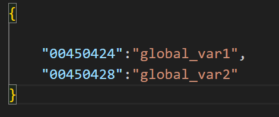
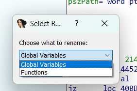
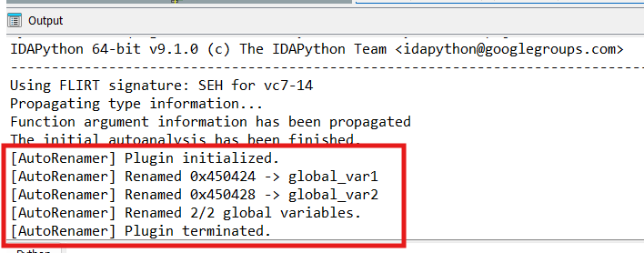

# idaAutoRenamer
An IDA plugin to rename global variables and functions based on JSON file.

## Main purpose:
I had the API Hashing problem in mind when I wrote this plugin. You could write an x64dbg script to retrieve the addresses and the names and then use this plugin to rename them.

## How to use:
- Put the plugin in the /plugins folder.
- Click on Edit-> Plugins
- Choose AutoRenamer
- Choose between renaming global variables and functions
- Open the JSON File
- That's it. Check the Output for details.

## Example:
- Let's say we want to rename the global variables at these adresses
- 
  

- Choose global variables in the prompt
- 
  

- See the result in the Output in the bottom
- 
  

